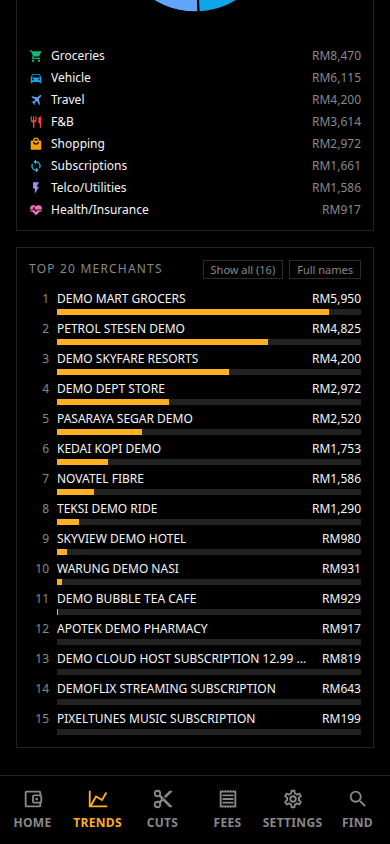
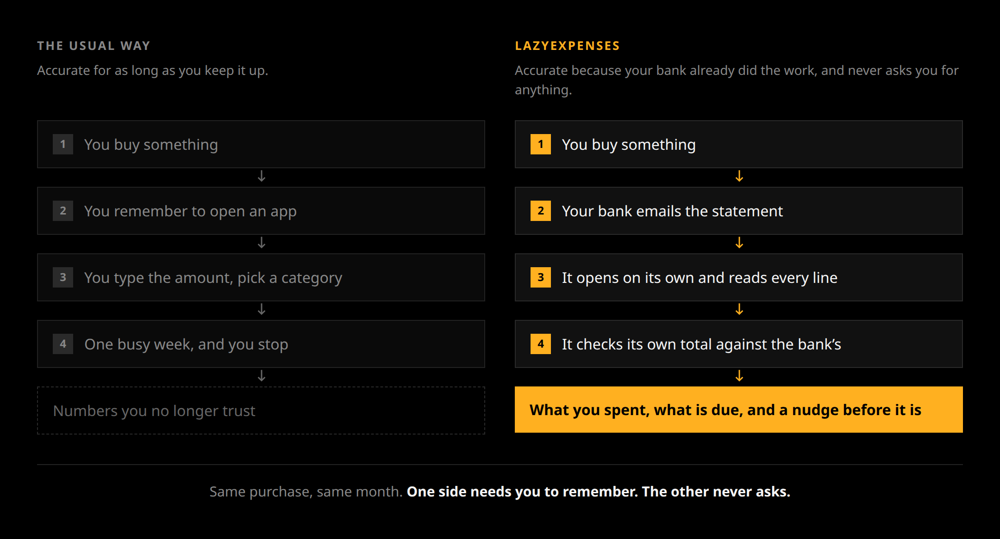

<p align="center">
  
</p>

<h1 align="center">lazyexpenses</h1>

<p align="center">
  Carrying a few cards, and losing track of what goes on which?<br>
  Want a nudge before each due date, so a missed one never lands on your credit score?<br>
  lazyexpenses reads the locked statement PDFs your Malaysian banks email you
  and turns them into a dashboard of what you actually spend.
</p>

<p align="center">
  <a href="LICENSE"></a>
  
  
  
  
</p>

<p align="center">
  <a href="https://officialdad.github.io/lazyexpenses/"><b>Try the live demo</b></a>
</p>

It runs on your own machine. There is no bank login to hand over, and nothing leaves the
box.

<!-- Refresh these six (#88): they are captured, not hand-shot, so a UI change updates them
     in one pass. From the repo root, with demo data already exported to web/static/data:
       cd web && npm run build && npm run preview -- --port 4173 --strictPort &
       AUDIT_BASE=http://localhost:4173 node web/audit-responsive.mjs
       cp web/audit-shots/readme-*.png docs/img/
     audit-responsive.mjs writes readme-<route>.png at 390x844 for the mobile tier, plus
     readme-merchants.png, the same /trends page scrolled to its merchants table.
     audit-shots/ is gitignored, so the copy into docs/img/ is the step that commits them. -->
<table>
  <tr>
    <td align="center" width="33%"><br><sub><b>Home</b>: free to spend, use-next card, bills due</sub></td>
    <td align="center" width="33%"><br><sub><b>Trends</b>: month by month, and by category</sub></td>
    <td align="center" width="33%"><br><sub><b>Merchants</b>: who actually took the money</sub></td>
  </tr>
  <tr>
    <td align="center"><br><sub><b>Cuts</b>: the leak finder, ranked by yearly cost</sub></td>
    <td align="center"><br><sub><b>Fees</b>: annual fees and what to call the bank about</sub></td>
    <td align="center"><br><sub><b>Settings</b>: the screen a new install opens on</sub></td>
  </tr>
</table>

*Every screenshot runs on the repository's synthetic demo data: invented merchants, `000N`
card numbers. Real statements never enter this repository. The
[live demo](https://officialdad.github.io/lazyexpenses/) is that same build on those same
invented statements. It is the static half only, so Settings, mark-paid and the reminders
all need the server and do nothing there.*

## Why it is called lazy

Every other spending app asks you for discipline. You tap the app after lunch, you type
the amount, you pick a category, and the month you stop doing that is the month the
numbers quietly stop being true.

This one never asks. The bank already wrote down what you spent, sent it to you, and
signed off on the total. That statement is the only thing this app reads.

<!-- Regenerate after editing docs/img/why-lazy.html:
       node docs/img/shoot.mjs               (needs web/node_modules, so run `cd web && npm i` once) -->
<p align="center">
  
</p>

Nothing in the second path needs you. You are not the one keeping it accurate, and
you cannot forget your way out of it. The worst you can do is nothing, which is the
point.

Because the statement is the source, the app also knows things a typed-in log never
does: what each card actually charged you, when each bill closes, and what the bank
says you owe on it.

## Start it

```bash
cp .env.example .env
docker compose up -d
```

Open <http://localhost:8000> and sign in with `changeme@123`. **That password is in a
public repository, so change it.** It is the `APP_PASSWORD` line in your `.env`, and
[docs/DEPLOY.md](docs/DEPLOY.md#locking-it-with-a-password) has the details.

The app opens on a setup page asking for one statement. Choose the bank it came from,
upload the PDF exactly as it arrived, and the page becomes a dashboard. If the PDF is
locked, it asks for the password right there. The bank derives that password from
something like your IC or date of birth, and the covering email says which.

That is the whole install. The password is the only thing in `.env` you have to set,
and there is nothing to schedule.

## What you get

- **A spending dashboard**, every card and every month, broken down by category. Spend is
  netted, so a refund comes off the category it was charged to rather than sitting
  somewhere as a stray credit.
- **A leak finder**: subscriptions you forgot about, categories creeping up and big
  one-offs, each ranked by what it costs you per year.
- **A debt tracker** for installment plans and balance transfers, with the months left on
  each read off the bank's own printed counter, and marked as an estimate where there is
  no counter to read.
- **Two reminders per bill.** The first arrives with the statement and carries the amount
  and the due date. The second lands three days before that date, and Settings changes the
  three. A bill keeps nagging while it is overdue, and the mark-paid toggle that stops it
  syncs across your devices.
- **Search across every transaction** from one box: merchant, category, card or amount,
  newest first. It is plain substring matching, so `groc` finds Groceries and `59.90`
  finds the charge, but a typo finds nothing.
- **Categories that learn.** A keyword map names most merchants outright; anything it does
  not recognise lands in `Other`, and picking a category for it once under **Settings**
  sticks for every statement past and future. If you run a local model, point the app at
  it and it drafts those picks for you to confirm. It stays off until you turn it on, and
  the model runs on your own machine.
- **One build for every screen.** Install it from the browser and it behaves like an app:
  a phone gets a bottom nav and one column, a tablet gets two, and a desktop gets the
  whole dashboard on one scrolling page. It keeps working with no connection, and new
  statements land without a rebuild.
- **An annual-fee tracker**, a "use next" card pick, and a monthly ceiling that shows what
  is actually free to spend once committed debt is out.

## Which banks

Six Malaysian ones:

- **Maybank**
- **CIMB** (several cards on one statement)
- **Standard Chartered**
- **Alliance** (several cards on one statement)
- **HSBC**
- **RHB** (several cards on one statement)

Where a statement covers several cards, each transaction still lands on the right one.

**Everything else is unsupported.** Each of these six needed its own rules, because
Maybank prints its address between a balance label and the balance, HSBC runs the words
together as `YourPreviousStatementBalance`, Alliance dates a transaction on the line above
it in Malay, and CIMB-i marks installments with a `:NN/MM` ratio. A statement from another
bank matches none of that. Amounts are RM throughout and nothing is converted.

Adding a bank is one branch in one function, and [CONTRIBUTING.md](CONTRIBUTING.md)
walks through it. If you would rather not write it yourself,
[open a bank request](https://github.com/officialdad/lazyexpenses/issues/new?template=bank-request.yml).
It asks for a redacted sample statement, because a layout nobody can read is a layout
nobody can parse, and it covers how to redact one without leaving the text sitting in the
file under a black box.

## How accurate is it

Every statement is checked the boring way: previous balance, plus what you spent, minus
what you paid, has to land on the new balance. On my own statements that is 78 of them,
each matching to the cent, out of 82 files: the other four are the same statements
arriving twice, and they are dropped rather than counted. If a bank changes its layout
and a statement stops adding up,
you get a flag rather than a wrong number you never notice.

## Statements arriving on their own

Label your statement mail `CC` in Gmail and the app checks for new ones every hour, so you
never upload another by hand. Turn it on under **Settings**. It needs a Gmail app
password rather than your Google password, and there is a Test button that tells you
whether it worked. [docs/DEPLOY.md](docs/DEPLOY.md#fetching-statements-from-gmail) covers
getting that app password.

## Bill reminders

Press **Remind me** next to the bills and allow notifications. You get one notification
when a statement lands, with the amount and the due date, and another a few days before
it is due. There are no accounts or tokens to set up anywhere. It needs `https://` or
`http://localhost` to work, and on an iPhone you have to add the app to the Home Screen
first. No domain and no public host? `docs/DEPLOY.md` has a
[self-signed HTTPS recipe](docs/DEPLOY.md#https-on-a-lan-ip-no-domain-and-no-vps) for a bare
LAN IP. Telegram is still there as a fallback for a desktop you never install the app on;
see [docs/DEPLOY.md](docs/DEPLOY.md#bill-reminders).

## Your data

Everything lives in one Docker volume: the statement PDFs as they arrived, the numbers
read out of them, and what you typed in Settings. Nothing leaves the box except the mail
it fetches for you and the reminders you asked it to send.

Anything you set in `.env` wins over the same setting in the app, and shows there as
locked. Passwords only ever go in; the app never hands one back, not even masked.

Three files on that volume are worth backing up beyond the PDFs: `settings.json` (what
you typed in Settings), `vapid.json` (losing it silently stops every reminder until each
device presses **Remind me** again) and `cats.json` (the merchant categories you
confirmed). Everything else rebuilds itself from the statements.

There is one password and no user accounts, so you cannot lock it down per person. Run
it on your own machine or a private network, not on the open internet.

## Prefer to run it yourself?

You do not have to run a server. The parser and the offline single-file dashboard are
plain scripts with one dependency. They need **Python 3.9 or newer**:

```bash
python3 -m venv .venv && . .venv/bin/activate   # Debian/Ubuntu: apt install python3-venv first
pip install pdfplumber
mkdir -p cc-statements                          # gitignored, so a fresh clone has no such directory
python parse.py        # reads cc-statements/*.pdf, writes CSVs, prints a reconciliation report
python dashboard.py    # builds dashboard.html, which opens offline in any browser
```

The virtual environment comes first for two reasons. Debian and Ubuntu ship `python3` and
no `python`, and inside the environment `python` resolves — so every other command in
these docs runs exactly as written. They also refuse a system-wide `pip install` with
`error: externally-managed-environment` (PEP 668), and the environment is what avoids
that. Open a new terminal later and run `. .venv/bin/activate` again before anything else.

Every statement in that report must say `VERIFIED`. `REVIEW` means the numbers did not
add up and something was misread; `NO_BALANCE` means the balances were not found at all.
With `cc-statements/` still empty, `parse.py` says so in one line instead of printing
nothing.

With no statements to hand, the repo can invent a year of them, one per bank per month.
Everything downstream runs on the fake ones exactly as it would on real data, and it is
the same invented dataset the screenshots above show:

```bash
python dev/make_demo_data.py --pdfs   # obviously fake statements into cc-statements/
python parse.py && python dashboard.py
```

[CONTRIBUTING.md](CONTRIBUTING.md) has the rest: the tests, the demo data generator and
how to add a bank. [docs/DEPLOY.md](docs/DEPLOY.md) is the full hosting reference: every
setting, putting it on your network, upgrading and backing up.

## Status

1.0, and in daily use on my own statements. The parser opens locked PDFs itself, and the
mail fetch and the reminders are timers inside the app, so one container is the whole
deployment. There is nothing else to host and nothing else to schedule.

## License

GNU GPL v3. See [LICENSE](LICENSE). Use it, change it, run it. Anything you hand on
to someone else stays under the same license and ships its source with it.
