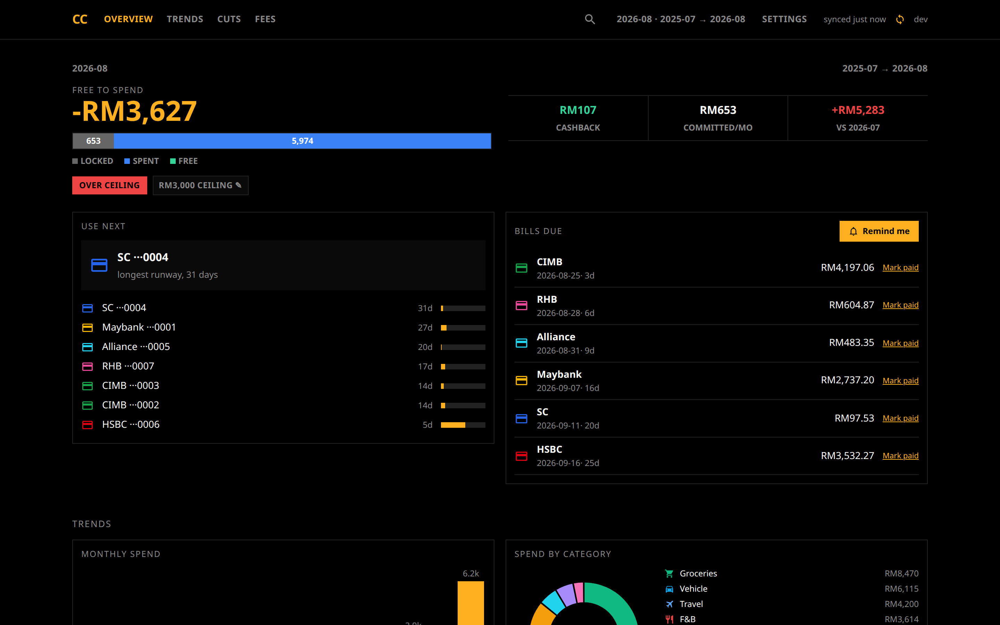
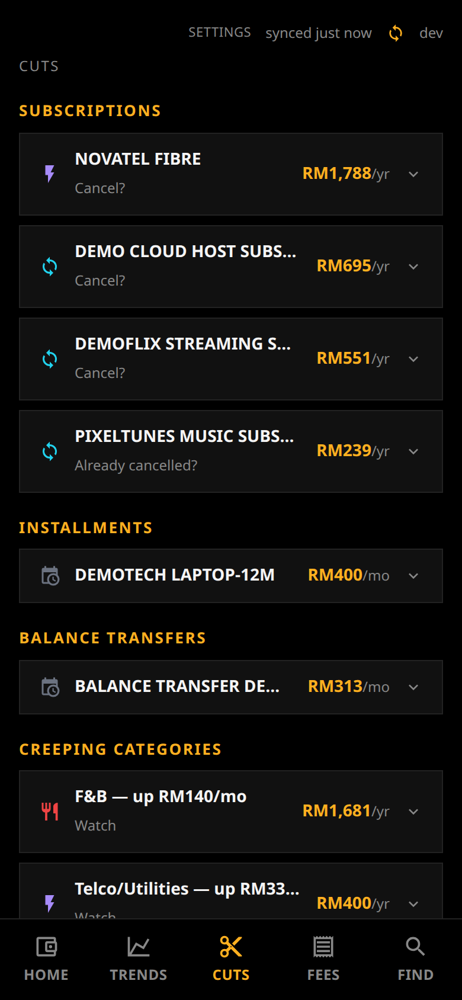

# lazyexpenses

Your banks email you a locked PDF every month and you never open it. lazyexpenses reads
those PDFs and turns them into a dashboard of what you actually spend. It runs on your
own machine, with no bank login to hand over and nothing leaving the box.



*Both screenshots run on the repository's synthetic demo data: invented merchants, `000N`
card numbers. Real statements never enter this repository.*

## Start it

```bash
cp .env.example .env
docker compose up -d
```

Open <http://localhost:8000> and sign in with `changeme@123`. **That password is in a
public repository, so change it.** It is the `APP_PASSWORD` line in your `.env`, and
[docs/DEPLOY.md](docs/DEPLOY.md#locking-it-with-a-password) has the details.

The app opens on a setup page asking for one statement. Choose the bank it came from,
upload the PDF exactly as it arrived, and the page becomes a dashboard. If the PDF is
locked, it asks for the password right there — the bank derives it from something like
your IC or date of birth, and the covering email says which.

That is the whole install. There is no `.env` to fill in beyond the password, no folder
to rename files into, and nothing to schedule.

## What you get

- **A spending dashboard**, every card and every month, broken down by category.
- **A leak finder** — subscriptions you forgot about, categories quietly creeping up, big
  one-offs, each ranked by what it costs you per year.
- **A debt tracker** for installment plans and balance transfers, with the months left on
  each read off the bank's own printed counter, and marked as an estimate where there is
  no counter to read.
- **Bills**, turning red when one is due within three days, with a mark-paid toggle that
  syncs across your devices.
- **An annual-fee tracker**, a "use next" card pick, a monthly ceiling with what is
  actually free to spend once committed debt is out, and search across every transaction.
- **A place to file the merchants it could not name.** Anything unrecognised lands in
  `Other`; pick its category once under **Settings** and it sticks, for every statement
  past and future.



## Which banks

Six Malaysian banks: **Maybank, CIMB, Standard Chartered, Alliance, HSBC, RHB**. CIMB,
Alliance and RHB put several cards on one statement, and each transaction still lands on
the right card.

**Everything else is unsupported**, and not by accident. Each of these six needed its own
rules, because Maybank prints its address between a balance label and the balance, HSBC
runs the words together as `YourPreviousStatementBalance`, Alliance dates a transaction on
the line above it in Malay, and CIMB-i marks installments with a `:NN/MM` ratio. A
statement from another bank matches none of that. Amounts are RM throughout and nothing is
converted.

Banking somewhere else? Adding a bank is one branch in one function, and
[CONTRIBUTING.md](CONTRIBUTING.md) walks through it.

## How accurate is it

Every statement is checked the boring way: previous balance, plus what you spent, minus
what you paid, has to land on the new balance. On my own statements that is 82 of them,
each matching to the cent. If a bank changes its layout and a statement stops adding up,
you get a flag rather than a wrong number you never notice.

## Statements arriving on their own

Label your statement mail `CC` in Gmail and the app checks for new ones every hour, so you
never upload another by hand. Turn it on under **Settings**. It needs a Gmail app
password rather than your Google password, and there is a Test button that tells you
whether it worked. [docs/DEPLOY.md](docs/DEPLOY.md#fetching-statements-from-gmail) covers
getting that app password.

## Bill reminders

Press **Remind me** next to the bills and allow notifications. That is the entire setup:
one notification when a statement lands, saying the amount and the due date, and one more
a few days before it is due — no accounts or tokens anywhere. It needs `https://` or `http://localhost` to work, and on an iPhone the app has
to be added to the Home Screen first. Telegram is still there as a fallback for a desktop
you never install the app on; see
[docs/DEPLOY.md](docs/DEPLOY.md#bill-reminders).

## Your data

Everything lives in one Docker volume: the statement PDFs as they arrived, the numbers
read out of them, and what you typed in Settings. Nothing is sent anywhere except the
mail you asked it to fetch and the reminders you asked it to send.

Anything you set in `.env` wins over the same setting in the app, and shows there as
locked. Passwords only ever go in; the app never hands one back, not even masked.

Three files on that volume are worth backing up beyond the PDFs: `settings.json` (what
you typed in Settings), `vapid.json` (losing it silently stops every reminder until each
device presses **Remind me** again) and `cats.json` (the merchant categories you
confirmed). Everything else rebuilds itself from the statements.

One password, no accounts, and no way to lock it down per person. Run it on your own
machine or a private network, not on the open internet.

## Prefer to run it yourself?

You do not have to run a server. The parser and the offline single-file dashboard are
plain scripts with one dependency:

```bash
python -m pip install pdfplumber
python parse.py        # reads cc-statements/*.pdf, writes CSVs, prints a reconciliation report
python dashboard.py    # builds dashboard.html, which opens offline in any browser
```

Every statement in that report should say `VERIFIED`. `REVIEW` means the numbers did not
add up and something was misread; `NO_BALANCE` means the balances were not found at all.

No statements to hand? The repo can invent a year of them, one per bank per month, and
everything downstream runs on the fake ones exactly as it would on real data. It is the
same invented dataset the screenshots above show:

```bash
python make_demo_data.py --pdfs   # obviously fake statements into cc-statements/
python parse.py && python dashboard.py
```

[CONTRIBUTING.md](CONTRIBUTING.md) has the rest — the tests, the demo data generator, and
how to add a bank. [docs/DEPLOY.md](docs/DEPLOY.md) is the full hosting reference: every
setting, putting it on your network, upgrading and backing up.

## Status

Working, and in daily use on my own statements. It used to lean on two self-hosted
services — n8n for the automation and Stirling-PDF just to strip statement passwords.
Both are gone: the parser opens locked PDFs itself, and the mail fetch and the reminders
are timers inside the app. One container is the whole deployment.

## License

MIT. See [LICENSE](LICENSE). Do what you like with it.
